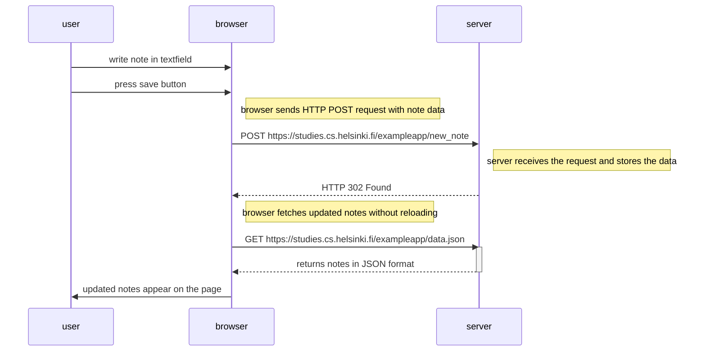

```mermaid
sequenceDiagram
    participant user
    participant browser
    participant server
    
    user->>browser: write note in textfield
    user->>browser: press save button
    
    note right of browser: browser sends HTTP POST request with note data
    browser->>server: POST https://studies.cs.helsinki.fi/exampleapp/new_note

    note right of server: server receives the request and stores the data
    server-->>browser: HTTP 302 Found
    
    note right of browser: browser fetches updated notes without reloading
    browser->>server: GET https://studies.cs.helsinki.fi/exampleapp/data.json
    activate server
    server-->>browser: returns notes in JSON format
    deactivate server

    browser->>user: updated notes appear on the page
```