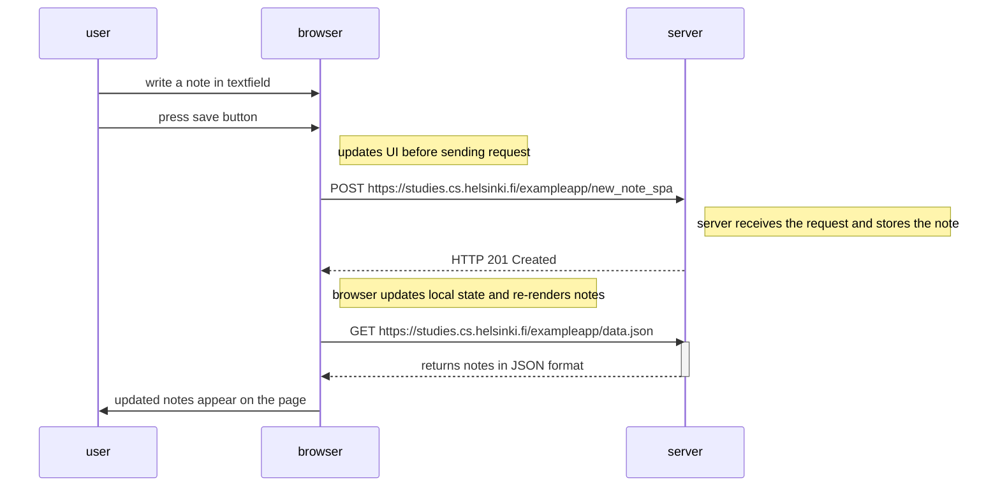

```mermaid
sequenceDiagram
    participant user
    participant browser
    participant server
    
    user->>browser: write a note in textfield
    user->>browser: press save button
    
    note right of browser: updates UI before sending request
    browser->>server: POST https://studies.cs.helsinki.fi/exampleapp/new_note_spa

    note right of server: server receives the request and stores the note
    server-->>browser: HTTP 201 Created
    
    note right of browser: browser updates local state and re-renders notes
    browser->>server: GET https://studies.cs.helsinki.fi/exampleapp/data.json
    activate server
    server-->>browser: returns notes in JSON format
    deactivate server

    browser->>user: updated notes appear on the page
```